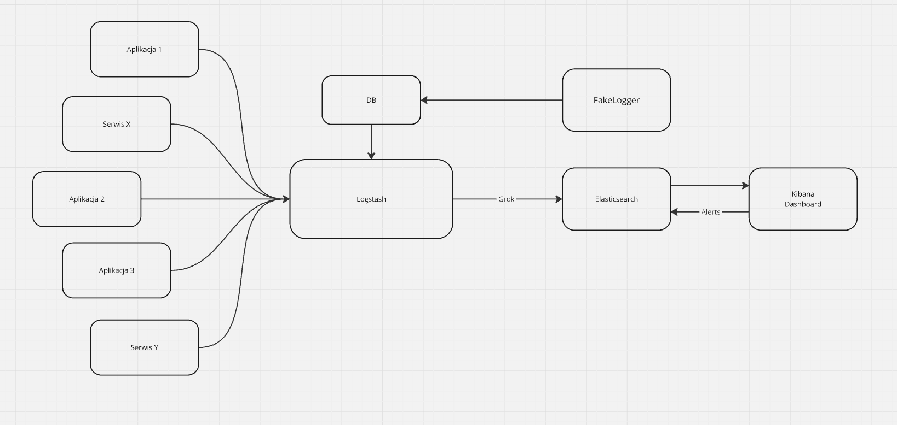
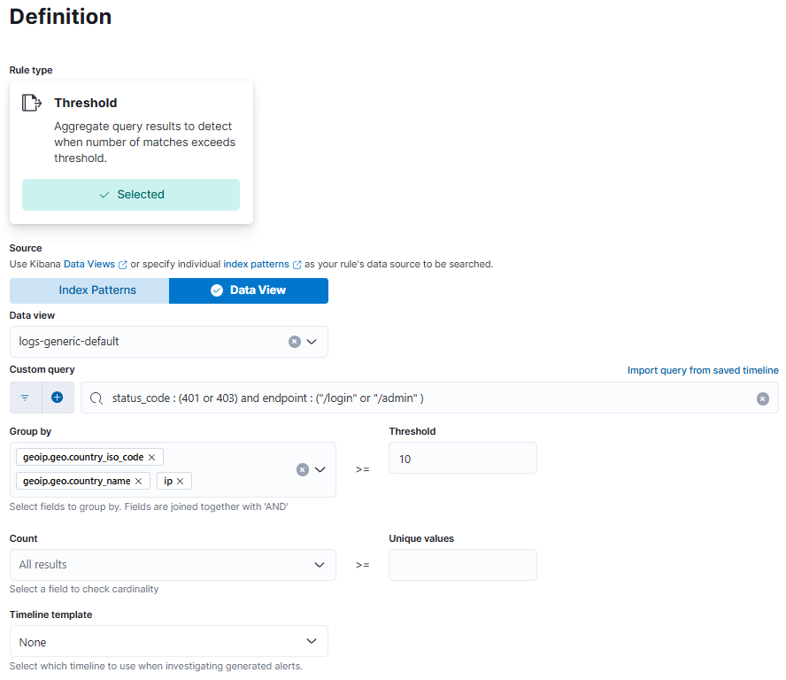
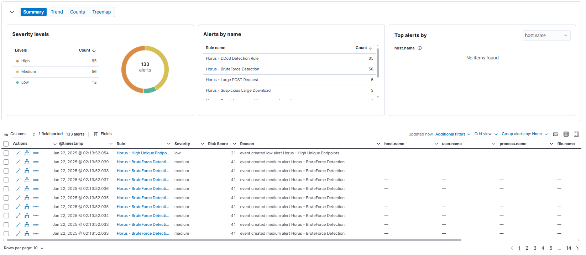
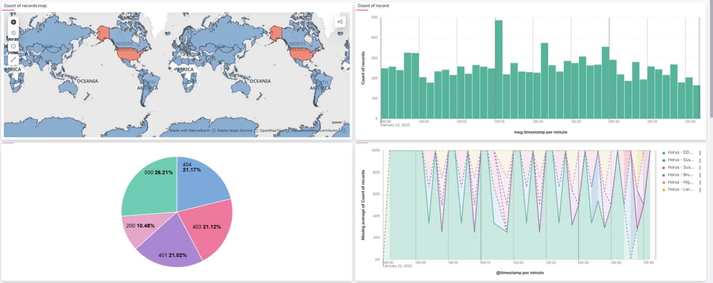
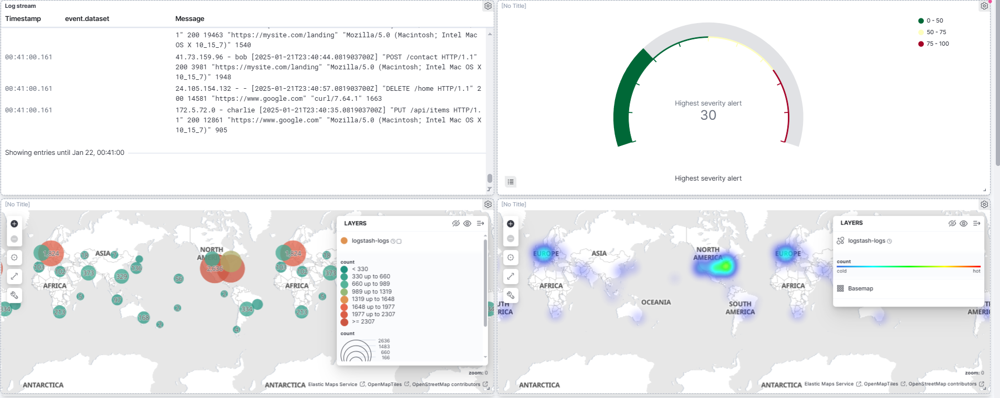

# Report - Horus: Analiza logów i wykrywanie zagrożeń

### Horus: Log analysis and threat detection

### Michał Kaniowski

---

## Wprowadzenie

Analiza logów i wykrywanie zagrożeń to krytyczne elementy nowoczesnych strategii cyberbezpieczeństwa.
Wraz z rozwojem usług online i wzrostem ilości generowanych danych, organizacje stają przed
coraz większymi wyzwaniami związanymi z identyfikacją złośliwych działań, takich jak ataki typu
Distributed Denial of Service (DDoS), próby logowania typu brute-force, rekonesans prowadzony przez
boty i eksfiltracja danych.
Dzienniki są często przechowywane w różnych systemach - serwerach internetowych,
serwerach aplikacji, bazach danych - co sprawia, że analiza w czasie rzeczywistym i korelacja
potencjalnych zagrożeń jest nietrywialnym przedsięwzięciem.

Potężnym i skalowalnym rozwiązaniem jest Elastic Stack (Elasticsearch, Logstash, Kibana i Beats).
Ten zestaw narzędzi open-source, zbudowany w oparciu o mocne strony szybkiego wyszukiwania Elasticsearch,
pomaga scentralizować zdarzenia i oferuje zaawansowane funkcje wykrywania zagrożeń.
Możliwość analizowania, przekształcania, wizualizacji i ostrzegania o danych w czasie zbliżonym
do rzeczywistego sprawia, że Elastic Stack jest atrakcyjnym wyborem dla organizacji dbających o
bezpieczeństwo. W tym dokumencie omówiono podejście do wdrażania analizy dzienników
i wykrywania zagrożeń bezpieczeństwa przy użyciu kombinacji potoków Logstash, pulpitów nawigacyjnych
Kibana i reguł wykrywania Kibana, wraz z zaawansowanymi filtrami dla geoip,
rozmiarów żądań i analiz agentów użytkowników.

## Zakres projektu

Głównym celem jest ustanowienie solidnego potoku do zbierania, analizowania i działania na dziennikach,
które mogą zawierać dowody zagrożeń bezpieczeństwa. Zakres projektu obejmuje:

Użyte narzędzia:

- **Elasticsearch** - silnik wyszukiwania i analizy danych
- **Logstash** - narzędzie do agregacji i przetwarzania logów
- **Kibana** - narzędzie do wizualizacji i analizy danych
- **Filebeat** - lekki agent do przekazywania logów do Logstash
- **Metricbeat** - lekki agent do przekazywania metryk do Logstash
- **Kotlin Spring Boot** - aplikacja do generowania logów
- **Docker** - narzędzie do konteneryzacji aplikacji
- **Postgres** - baza danych do przechowywania logów

**Elastic Stack** ma ugruntowaną pozycję, jest open source (z komercyjnymi ulepszeniami),
jest wysoce rozszerzalny i oferuje wgląd w dane niemal w czasie rzeczywistym.

**Logstash** zapewnia elastyczne analizowanie i wzbogacanie danych.

**Kibana** oferuje intuicyjne pulpity nawigacyjne, konfigurację reguł wykrywania i
przyjazny dla użytkownika interfejs dla analityków bezpieczeństwa.

Wzbogacanie GeoIP pomaga wykrywać podejrzany ruch z określonych regionów.

Wykrywanie agentów użytkownika pomaga w oznaczaniu potencjalnie złośliwych lub opartych na
skryptach narzędzi skanujących (np. curl, sqlmap, python-requests).

Koncentrując się na tych narzędziach, zapewniamy, że możemy zająć się
szerokim zestawem zagrożeń - od DDoS na dużą skalę po subtelną eksfiltrację danych - w ramach
jednej, ujednoliconej architektury.

Diagram przedstawiający cały system:



## Opis działania systemu

### Pozyskiwanie i analiza logów

Proces rozpoczyna się od pobrania przez Logstash logów z bazy danych PostgreSQL lub bezpośrednio z aplikacji/serwisów,
które nas interesują. W przypadku tego systemu analozowane są tylko logi HTTP pochodzące z Nginx. Istnieje jednak łatwa
możliwość dodania kolejnych integracji i zbierania logów z wielu różnych źródeł. Przykładowe logi HTTP z Nginx:

```
167.156.242.235 - - [2024-12-10 14:05:12] "PUT /admin HTTP/1.1" 200 184
"https://example.com/data" "curl/7.68.0" 629
```

Każdy wpis dziennika jest analizowany przez grok w celu ustrukturyzowania pól takich jak:

- Adres IP (client.ip lub msg.ip)
- znacznik czasu (@timestamp)
- metoda HTTP, kod statusu, ścieżka żądania
- ciąg user_agent, który jest następnie przetwarzany przez filtr useragent w celu klasyfikacji przeglądarek i botów
- filtr geoip, który rozwiązuje adres IP na kod kraju, region i szerokość/długość geograficzną.

Użyty filtr grok:
```yaml
filter {
  grok {
    match => {
      "message" => "%{IP:msg.ip} - %{DATA:msg.user} 
        \[%{TIMESTAMP_ISO8601:msg.timestamp}\]
        \"%{DATA:msg.method} %{DATA:msg.endpoint}
        %{DATA:msg.protocol}\" %{NUMBER:msg.statusCode}
        %{NUMBER:msg.bodyBytesSent} \"%{DATA:msg.httpReferer}\"
        \"%{DATA:msg.userAgent}\" %{NUMBER:msg.requestLength}"
    }
  }
  date {
      match => ["timestamp", "yyyy-MM-dd HH:mm:ss",
        "ISO8601", "yyyy-MM-dd'T'HH:mm:ss.SSS'Z'"]
      target => "@timestamp"
  }
  useragent {
    source => "user_agent"
    target => "user_agent_info"
  }
  geoip {
    source => "ip"
    target => "geoip"
  }
}
```

W przykładzie działania systemu nie użyto logów bezpośrednio z aplikacji/serwisów, z powodu braku dostępu.
Zamiast tego, logi są generowane przez aplikację Kotlin Spring Boot, która stara się symulować zwyczajne działanie
systemu.
W losowych momentach (15% szans co każde 30 sekund) apliakcja generuje anamolaie takie jak DDoS, Brute Force itp.
Kod dostępny jest w src/main/kotlin/org/horus/horus/utils/FakeLogger.kt

### Wykrywanie anomalii

Kibana oferuje zaawansowane funkcje wykrywania zagrożeń, które pozwalają na definiowanie reguł opartych na prograch.
W tym przypadku, zdefiniowano reguły wykrywania dla:

- DDoS
- Brute Force
- Przeszukiwanie endpointów (rekonesans)
- Requesty o dużej ilości danych
- Duża i częsta ilość prób pobierania danych
- Duża aktywność z krajów uwzględnionych na liście ostrzeżeń

Każda reguła może mieć określoną wartość "severity", która pozwala na klasyfikację zagrożeń na podstawie ich
potencjalnego wpływu na system. Dodatkowo można zdefiniowac whitelisty i blacklisty dla tych reguł.

Przykładowa reguła wykrywająca Brute Force:



### Alertowanie i indeksowanie

Każda reguła wykrywania może utworzyć dokument alertu w oddzielnym indeksie (np. security-alerts).
Ten dokument JSON zazwyczaj zawiera szczegóły takie jak:

- znacznik czasu
- Adres IP atakującego
- Nazwa lub identyfikator reguły
- Komunikat opisujący podejrzaną aktywność (np. „Przekroczono próg dużego żądania od RU”).

W przypadku wykrycia zagrożenia, alert jest indeksowany w Elasticsearch i może być dalej przetwarzany.
Dostępne są również gotowe zestawy zasad dla popularnych systemów takich jak AWS, Azure, GCP, Docker, Kubernetes, itp.
Analiza logów nie ogranicza się tylko do logów HTTP, ale może obejmować również logi systemowe, logi aplikacji, metryki.
Dla komercyjnej wersji Elastic Stack, można również skonfigurować alarmy e-mail oraz integracje z systemami.

Zaindeksowane ostrzeżenia mogą być następnie wykorzystane do analizy trendów, raportowania i tworzenia dashboardów.

Domyślny dashboard zgłoszeń:



## Rezultaty testów

Reguły progowe w Kibana skutecznie przechwytują serie ruchu, które przekraczają normalne linie bazowe.
Wzbogacanie GeoIP umożliwia szybką identyfikację podejrzanych źródeł ruchu - szczególnie przydatne do wyróżniania
regionów,
które nie wchodzą w interakcje z systemem. Reguły wykrywania pobierania i wysyłania dużych plików pomogły zidentyfikować
próby eksfiltracji plików testowych, wyzwalając alerty za każdym razem, gdy bodyBytesSent przekroczył próg. Pulpity
nawigacyjne ujednolicają dzienniki operacyjne i alerty bezpieczeństwa, umożliwiając szybką korelację między anomaliami
ruchu a wyzwalanymi alertami.

Stack Elastic jest jednak systemem wymagającym dużych zasobów obliczeniowych i pamięciowych, co może stanowić problem w
przypadku mniejszych serwerów. Konfiguracja stosu jest nie najlepiej udokumentowana, co powoduje długie błądzenie po
plikach konfiguracyjnych. Model biznesowy Elastic Stack ogranicza sporą część funkcjonalności. Możliwość informowania o
alertach przy pomocy wysłania requestu lub użycia webhooka powinna być dostępna dla wszystkich użytkowników, a nie tylko
dla tych, którzy wykupili subskrypcję.

Wyniki te potwierdzają, że Elastic Stack może niezawodnie wykrywać i ostrzegać o wielu formach złośliwej aktywności,
znacznie skracając czas badania podejrzanych adresów IP lub dużych transferów danych.

Przykładowe dashboardy:




## Podsumowanie

Analizowane rozwiązanie oparte na Logstash do pozyskiwania i analizowania logów - Elasticsearch
oraz Kibana do wizualizacji i wykrywania - oferuje kompleksową platformę do monitorowania i zabezpieczania
infrastruktury internetowej. Zbierając logi HTTP, wzbogacając je o metadane geolokalizacji i agenta użytkownika oraz
stosując reguły wykrywania oparte na progach, można szybko identyfikować zagrożenia, takie
jak DDoS, ataki brute-force, podejrzane boty, próby skanowania i duże transfery danych, które mogą wskazywać na
eksfiltrację.

Kluczowe wnioski obejmują:

- Modułowa i rozszerzalna: Architektura Elastic Stack umożliwia płynne dodawanie nowych źródeł logów, filtrów i reguł
  wykrywania.
- Alerty w czasie rzeczywistym: Reguły wykrywania mogą być uruchamiane w czasie zbliżonym do rzeczywistego, zmniejszając
  czas, w którym atakujący mogą pozostać niezauważeni.
- Ujednolicona widoczność: Pojedynczy pulpit nawigacyjny korelujący dzienniki i alerty bezpieczeństwa zwiększa wydajność
  reagowania na incydenty.
- Personalizacja: Wartości progowe, okna czasowe i akcje ostrzegawcze można precyzyjnie dostosować do tolerancji ryzyka
  i wzorców operacyjnych organizacji.

Integracja wykrywania anomalii za pomocą uczenia maszynowego (ML) (dostępnego w wersji komercyjnej) może
jeszcze bardziej zwiększyć zdolność systemu do wykrywania subtelnych zagrożeń. Jednak nawet bez ML proponowane
rozwiązanie zapewnia solidne i skalowalne podejście do analizy dzienników i wykrywania zagrożeń, poprawiając zarówno
stan bezpieczeństwa, jak i możliwości dochodzeniowe.